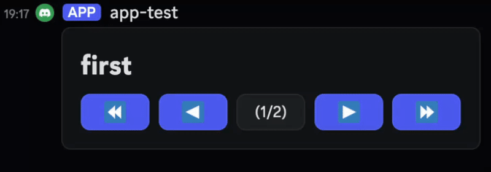

# disgo-paginated-container



- [disgo](https://github.com/disgoorg/disgo)에서 ComponentsV2의 Container를 쉽게 페이지처럼 만들어서 쓸 수 있는 라이브러리입니다.

# 설치

```sh
go get github.com/Migan178/disgo-paginated-container
```

# 사용법

```go
package main

import (
    "github.com/Migan178/disgo-paginated-container/pagination"
    "github.com/disgoorg/disgo/discord"
    "github.com/disgoorg/disgo/events"
)

func onMessageCreate(e *events.MessageCreate) {
    if e.Message.Content == "page" {
        pagination.New(e,
            false, // deferred
            nil,   // options
			discord.NewContainer(discord.NewTextDisplay("# first")),
			discord.NewContainer(discord.NewTextDisplay("# second")),
		).Start()
        return
    }
}
```

- [examples](examples/) 폴더에서 확인할 수 있습니다.
